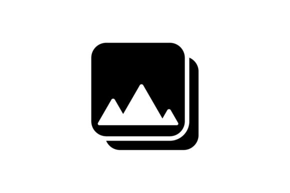

  

## Team Name

## Team Members
- ***Bahar Arın*** - ROL/Data Scientist/Product Owner
- ***Kübra Hande Çendik*** - ROL/Data Scientist/Product Owner
- ***Mustafa Said Güngör*** - Scrum Master
- ***Mehmet Efe Afşar*** - ROL/AI Specialist/Web Developer/Product Owner
<!-- - ***Pınar Güzel*** - ROL/AI Specialist/Web Developer/Product Owner -->

## Product Name
Product Name

## Product Backlog List
- [AI 152 Trello Sprint Board - 1](https://trello.com/b/QcRPIhZZ/1-sprint)
- [AI 152 Trello Sprint Board - 2](https://trello.com/b/wnCAaBHt/2-sprint)
- [AI 152 Trello Sprint Board - 3](https://trello.com/b/xcPH4JYu/3-sprint)

## Product Description
aaa

## Product Features
- 
- 
- 
- 
- 
- 

## Target Group
- 
- 
- 
- 

## Links
- [Check Out Our Product](https://github.com/mustafagungormd/Bootcamp_AI-152)
- [Watch Trailer on Youtube](https://www.youtube.com/watch?v=LpNVf8sczqU)

---
# **SPRINT 1**

   |  |
   |:---------------------------------:|

- It has been decided that the score evaluation for the sprint will be 20.
- Score completion logic: The backlog score that must be completed throughout the project is expected to be 50. The number of points to be completed for the first Sprint was determined as 20, and the target score was reached by obtaining 20 points.

### **Sprint 1 Notes**
- aaaa
- aaaa  

  **To Do List:**
- bbb
- bbb
- bbb
- bbb

### **Sprint 1 Board**
   |  |
   |:---------------------------------:|
   | Sprint 1 board                         |

### **Daily Scrum**

* Daily scrum was held via WhatsApp and Google Meet. Google Meet meeting notes can be found on Trello as cards in the "Meeting Logs" list.

   |  |
   |:---------------------------------:|
   | Initially, communication was established via WhatsApp, and WhatsApp was preferred for daily communication                         |

   |  |
   |:---------------------------------:|
   | Google Meet was preferred for planning and collaborative work.                         |

   |  |
   |:---------------------------------:|
   | Recordings of Google Meet meetings can be found on Trello as cards in the "Meeting Logs" list                         |

  
### **Development Progress**
* aaa

   |  |  |
   |:---------------------------------:|:-----------------------------------:|
   | aaa                        | bbb                        |

* bbb

   |  |  |
   |:---------------------------------:|:-----------------------------------:|
   | aaa                        | bbb                         |

* aaa

   |  |
   |:---------------------------------:|
   | aaa                       |

* aaa

   |  |
   |:---------------------------------:|
   | aaa                        |

* aaa

   |  |
   |:aaa                         |

 ### **Sprint Review**
- At the end of Sprint 1, the team met and the Sprint was reviewed. The intended tasks have all been completed. 
Sprint Review participants:

 ### **Sprint Retrospective**
- The score for Sprint 1 is 20.

---
# **SPRINT 2**

   |  |
   |:---------------------------------:|

- It has been decided that the score evaluation for the sprint will be 15.
- Score completion logic: The backlog score that must be completed throughout the project is expected to be 50. The number of points to be completed for the second Sprint was determined as 15, and the target score was reached by obtaining 15 points.

### **Sprint 2 Notes**
- At the beginning of the second sprint the team has discussed which tasks will be completed in the second sprint. 

  **To Do List:**
- aaa

### **Sprint 2 Board**
   |  |
   |:---------------------------------:|
   | Sprint 2 board                         |

### **Daily Scrum**

* Daily scrum was held via WhatsApp and Google Meet. Google Meet meeting notes can be found on Trello as cards in the "Meeting Logs" list.

   |  |
   |:---------------------------------:|
   | WhatsApp meeting logs                        |

   |  |
   |:---------------------------------:|
   | Google Meet meeting logs                        |

   |  |
   |:---------------------------------:|
   | Trello meeting logs                        |

  
### **Development Progress**
* aaa

   |  |  |
   |:---------------------------------:|:-----------------------------------:|
   | aaa                      | bbb                       |

* aaa

   |  |  |
   |:---------------------------------:|:-----------------------------------:|
   | aaa                       | bbb                      |

* aaa

   |  |
   |:---------------------------------:|
   | aaa                        |

* aaa

   |  | 
   |:---------------------------------:|
   | aaa                       |

* aaa

   |  |
   |:---------------------------------:|
   | aaa                       |

   |  |
   |:---------------------------------:|
   | aaa                       |

   |  |
   |:---------------------------------:|
   | aaa                       |

* aaa

   |  |
   |:---------------------------------:|
   | aaa                      |

 ### **Sprint Review**
- At the end of Sprint 2, the team met to review the Sprint. The intended tasks have all been completed.
Sprint Review participants:

 ### **Sprint Retrospective**
- The score for Sprint 2 is 15.

---
# **SPRINT 3**

   |  |
   |:---------------------------------:|

- It has been decided that the score evaluation for the sprint will be 15.
- Score completion logic: The backlog score that must be completed throughout the project is expected to be 50. The number of points to be completed for the third and final Sprint was determined as 15, and the target score was reached by obtaining 15 points.

  
### **Sprint 3 Notes**
- At the beginning of the third sprint the team has discussed which tasks will be completed in the third sprint.

  **To Do List:**
-	aaa

### **Sprint 3 Board**
   | |
   |:---------------------------------:|
   | Sprint 3 board                         |

### **Daily Scrum**

* Daily scrum was held via WhatsApp and Google Meet. Google Meet meeting notes can be found on Trello as cards in the "Meeting Logs" list.

   |  |
   |:---------------------------------:|
   | WhatsApp meeting logs                        |

   |  |
   |:---------------------------------:|
   | Google Meet meeting logs                        |

   |  |
   |:---------------------------------:|
   | Trello meeting logs                        |

  
### **Development Progress**

* aaa

   |  |
   |:---------------------------------:|
   | aaa                        |

* aaa
   |  |
   |:---------------------------------:|
   | aaa               |

  

 ### **Sprint Review**
- At the end of Sprint 3, the entire development process were reviewed. The intended tasks have all been completed. The development is successfully completed.
- Sprint Review participants:

 ### **Sprint Retrospective**
- aaa
