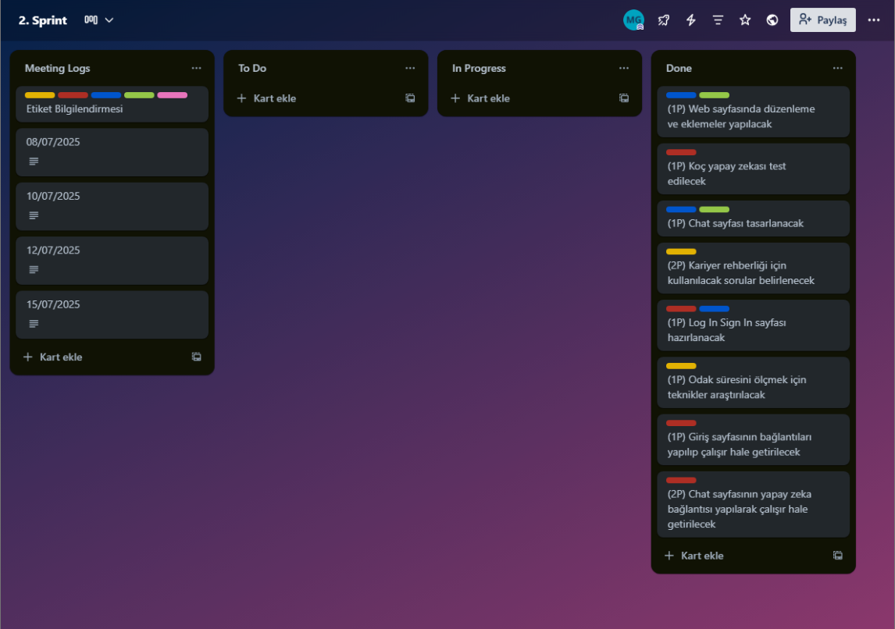

  

## Takım İsmi

## Takım Üyeleri
- ***Bahar Arın*** - ROL/Data Scientist/Product Owner
- ***Kübra Hande Çendik*** - Data Scientist
- ***Mustafa Said Güngör*** - Scrum Master
- ***Mehmet Efe Afşar*** - Product Owner
- ***Pınar Güzel*** - AI Specialist/Web Developer

## Ürün İsmi
GOAT COACH

## Ürün Backlog Listesi
- [AI 152 Trello Sprint Board - 1](https://trello.com/b/QcRPIhZZ/1-sprint)
- [AI 152 Trello Sprint Board - 2](https://trello.com/b/wnCAaBHt/2-sprint)
- [AI 152 Trello Sprint Board - 3](https://trello.com/b/xcPH4JYu/3-sprint)

## Ürün Açıklaması

## Ürün Özellikleri
- 
- 
- 
- 
- 
- 

## Hedef Kitle
- 
- 
- 
- 

## Linkler
- [Check Out Our Product](https://github.com/mustafagungormd/Bootcamp_AI-152)
- [Watch Trailer on Youtube](https://www.youtube.com/watch?v=LpNVf8sczqU)

---
# **SPRINT 1**

   |  |
   |:---------------------------------:|

<!--  - It has been decided that the score evaluation for the sprint will be 20. -->
<!--  - Score completion logic: The backlog score that must be completed throughout the project is expected to be 50. The number of points to be completed for the first Sprint was determined as 20, and the target score was reached by obtaining 20 points. -->

### **Sprint 1 Notları**
- 
-   

  **Yapılanlar:**
- 
- 
- 
- 

### **Sprint 1 Board**
   |  |
   |:---------------------------------:|
   | Sprint 1 board                         |

### **Daily Scrum**

* Daily scrum was held via WhatsApp and Google Meet. Google Meet meeting notes can be found on Trello as cards in the "Meeting Logs" list.

   |  |
   |:---------------------------------:|
   | WhatsApp meeting logs                        |

   |  |
   |:---------------------------------:|
   | Google Meet meeting logs                        |

   |  |
   |:---------------------------------:|
   | Trello meeting logs                        |

  
### **Geliştirme Süreci**
* 

   |  |  |
   |:---------------------------------:|:-----------------------------------:|
   |                         |                         |

* 

   |  |  |
   |:---------------------------------:|:-----------------------------------:|
   |                         |                          |

* 

   |  |
   |:---------------------------------:|
   |                        |

* 

   |  |
   |:---------------------------------:|
   |                         |

* 

   |  |
   |:---------------------------------:|
   |                          |

 ### **Sprint Review**
<!--  - Sprint 1’in sonunda, ekip bir araya geldi ve Sprint gözden geçirildi. Planlanan tüm görevler tamamlandı. -->
Sprint Review participants:

 ### **Sprint Retrospective**
<!-- - Sprint 1 sonunda ulaşılan skor 20 puan -->

---
