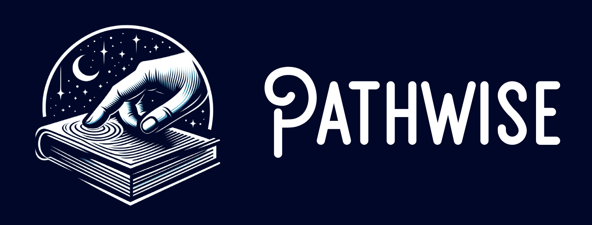

  

## Takım İsmi

## Takım Üyeleri
- ***Bahar Arın*** - Data Scientist
- ***Kübra Hande Çendik*** - Data Scientist
- ***Mustafa Said Güngör*** - Scrum Master
- ***Mehmet Efe Afşar*** - Product Owner
- ***Pınar Güzel*** - AI Specialist

## Ürün İsmi
GOAT COACH

## Ürün Backlog Listesi
- [AI 152 Trello Sprint Board - 1](https://trello.com/b/QcRPIhZZ/1-sprint)
- [AI 152 Trello Sprint Board - 2](https://trello.com/b/wnCAaBHt/2-sprint)
- [AI 152 Trello Sprint Board - 3](https://trello.com/b/xcPH4JYu/3-sprint)

## Ürün Açıklaması
Eğitim ve kariyer yolculuğunda bireylere kişiselleştirilmiş rehberlik sunmak amacıyla geliştirilen bu dijital asistan, her yaştan öğrenci ve bireyin potansiyelini en verimli şekilde ortaya çıkarmasını hedefliyor. Üç modülden oluşan bu araç; bireyin ilgi ve yeteneklerini analiz ederek en uygun kariyer yollarını öneren Kariyer Koçu, sınavlara hazırlık sürecini öğrencinin seviyesine göre optimize eden Sınav Koçu ve bir konunun etkili biçimde nasıl çalışılması gerektiğini kişiye özel planlayan Konu Koçu ile bütünsel bir rehberlik sunar. Web tabanlı yapısıyla her yerden erişilebilir olan bu platform, bireylerin hem akademik hem de kariyer alanında bilinçli ve hedef odaklı ilerlemesini sağlar.

## Ürün Özellikleri
- Web tabanlı
- Her cihazdan erişim imkânı
- Yaşa ve seviyeye göre uyarlanabilir dinamik içerik
- Yapay zeka destekli gelişmiş rehberlik ve akıllı planlama desteği

## Hedef Kitle
- İlköğretim ve ortaokul öğrencileri 
- Lise öğrencileri
- Üniversite öğrencileri
- Veliler ve eğitim danışmanları

## Linkler
- [Check Out Our Product](https://github.com/mustafagungormd/Bootcamp_AI-152)
- [Watch Trailer on Youtube](https://www.youtube.com/watch?v=LpNVf8sczqU)

---
# **SPRINT 1**

   |  |
   |:---------------------------------:|

- Puan tamamlama mantığı: Proje boyunca tamamlanması gereken toplam backlog puanı 30 olarak belirlendi. İlk sprint için puan değerlendirmesinin 10 üzerinden yapılmasına karar verildi. Sprintteki her görevin puanı 1 puan olarak belirlendi. 
- İlk sprint için tamamlanması gereken puan 10 üzerinden 10 puan alınarak hedefe ulaşıldı.

### **Sprint 1 Notları**
- Bu sprintte geliştireceğimiz ürüne karar vermek için ekipçe beyin fırtınası yapıldı ve ürüne karar verildi.
- Ürünün temel özellikleri ve geliştirme sürecinin genel adımları belirlendi.
- Takımın görev dağılımı yapıldı.  

  **Yapılacaklar:**
- Ürünümüz için geliştirilecek web sitesi tasarımının ana hatları belirlenecek
- Siteye giriş için oturum açma sistemi yazılacak
- Sınav Koçu için yapay zeka altyapısı hazırlanacak
- Sınav Koçu için gereken paramatreler belirlenip veri setleri oluşturulacak

### **Sprint 1 Board**
   |  |
   |:---------------------------------:|
   | Sprint 1 board                         |

### **Daily Scrum**

* Günlük scrum toplantıları WhatsApp ve Google Meet üzerinden yapıldı. Google Meet toplantı notları, Trello'daki "Meeting Logs" listesine kartlar olarak eklendi.

   |  |
   |:---------------------------------:|
   | WhatsApp toplantı kayıtları                        |

   |  |
   |:---------------------------------:|
   | Google Meet toplantı kayıtları                       |

   |  |
   |:---------------------------------:|
   | Trello toplantı kayıtları                        |

  
### **Geliştirme Süreci**
* Siteye giriş için oturum açma özelliğinin altyapısı hazırlandı ve yapay zekanın ana algoritması yazıldı.

   |  |  |
   |:---------------------------------:|:-----------------------------------:|
   | Otorizasyon Altyapısı                        | Ana AI Algoritması                        |

* Web sayfasının tasarımına başlandı ve ana sayfa tasarımı tamamlandı.

   |  |
   |:---------------------------------:|
   | Ana Sayfa                       |

 ### **Sprint Review**
- Sprint 1’in sonunda, ekip bir araya geldi ve Sprint gözden geçirildi.
- Planlanan tüm görevler tamamlandı.
- Gelecek sprint için yapılacak şeylerin kaba planlamaları yapıldı.
- Sonraki sprint için başlanmış olan görevlerin ilerleyişi değerlendirildi.
- Sprint1'de tahmini tamamlama süresi beklenenden uzun süren görevlerle karşılaşıldığından, 2. sprintteki görevlere ayrılacak tahmini tamamlama sürelerinin gerçekçi şekilde belirlenmesi için gereken tedbirlerin alınmasına karar verildi.

  **Sprint Review participants:** Bahar Arın, Kübra Hande Çendik, Mustafa Said Güngör, Mehmet Efe Afşar

 ### **Sprint Retrospective**
- Sprint 1 sonunda ulaşılan skor 10 puan oldu.
- Oturum açma sistemi altyapısı hazırlandı.
- Sınav Koçu için yapay zeka altyapısı hazırlandı.
- Sınav Koçu için gereken paramatreler belirlenip veri setleri oluşturuldu.

---
