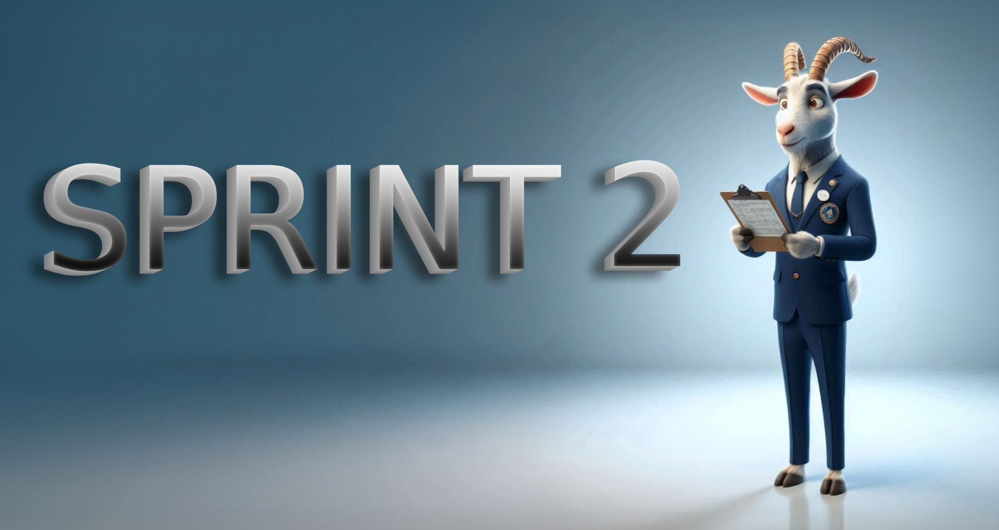

  

## Takım İsmi

  

## Takım Üyeleri
   |  |  |  |  |
   |:---------------------------------:|:-----------------------------------:|:-----------------------------------:|:-----------------------------------:|
   | Bahar Arın                        | Kübra Hande Çendik                        | Mustafa Said Güngör                        | Mehmet Efe Afşar                        |
   | Data Scientist                        | Data Scientist                        | Scrum Master                        | Product Owner                        |

## Ürün İsmi
GOAT COACH

## Ürün Backlog Listesi
- [AI 152 Trello Sprint Board - 1](https://trello.com/b/QcRPIhZZ/1-sprint)
- [AI 152 Trello Sprint Board - 2](https://trello.com/b/wnCAaBHt/2-sprint)
- [AI 152 Trello Sprint Board - 3](https://trello.com/b/xcPH4JYu/3-sprint)

## Ürün Açıklaması
Eğitim ve kariyer yolculuğunda bireylere kişiselleştirilmiş rehberlik sunmak amacıyla geliştirilen bu dijital asistan, her yaştan öğrenci ve bireyin potansiyelini en verimli şekilde ortaya çıkarmasını hedefliyor. Üç modülden oluşan bu araç; bireyin ilgi ve yeteneklerini analiz ederek en uygun kariyer yollarını öneren Kariyer Koçu, sınavlara hazırlık sürecini öğrencinin seviyesine göre optimize eden Sınav Koçu ve bir konunun etkili biçimde nasıl çalışılması gerektiğini kişiye özel planlayan Konu Koçu ile bütünsel bir rehberlik sunar. Web tabanlı yapısıyla her yerden erişilebilir olan bu platform, bireylerin hem akademik hem de kariyer alanında bilinçli ve hedef odaklı ilerlemesini sağlar.

## Ürün Özellikleri
- Web tabanlı
- Her cihazdan erişim imkânı
- Yaşa ve seviyeye göre uyarlanabilir dinamik içerik
- Yapay zeka destekli gelişmiş rehberlik ve akıllı planlama desteği

## Hedef Kitle
- İlköğretim ve ortaokul öğrencileri 
- Lise öğrencileri
- Üniversite öğrencileri
- Veliler ve eğitim danışmanları

## Linkler
- [Check Out Our Product](https://github.com/mustafagungormd/Bootcamp_AI-152)
- [Watch Trailer on Youtube](https://www.youtube.com/watch?v=LpNVf8sczqU)

---
# **SPRINT 1**

   |  |
   |:---------------------------------:|

- Puan tamamlama mantığı: Proje boyunca tamamlanması gereken toplam backlog puanı 30 olarak belirlendi. İlk sprint için puan değerlendirmesinin 10 üzerinden yapılmasına karar verildi. Sprintteki her görevin puanı 1 puan olarak belirlendi. 
- İlk sprint için tamamlanması gereken puan 10 üzerinden 10 puan alınarak hedefe ulaşıldı.

### **Sprint 1 Notları**
- Bu sprintte geliştireceğimiz ürüne karar vermek için ekipçe beyin fırtınası yapıldı ve ürüne karar verildi.
- Ürünün temel özellikleri ve geliştirme sürecinin genel adımları belirlendi.
- Takımın görev dağılımı yapıldı.  

  **Yapılacaklar:**
- Ürünümüz için geliştirilecek web sitesi tasarımının ana hatları belirlenecek
- Siteye giriş için oturum açma sistemi yazılacak
- Sınav Koçu için yapay zeka altyapısı hazırlanacak
- Sınav Koçu için gereken paramatreler belirlenip veri setleri oluşturulacak

### **Sprint 1 Board**
   |  |
   |:---------------------------------:|
   | Sprint 1 board                         |

### **Daily Scrum**

* Günlük scrum toplantıları WhatsApp ve Google Meet üzerinden yapıldı. Google Meet toplantı notları, Trello'daki "Meeting Logs" listesine kartlar olarak eklendi.

   |  |
   |:---------------------------------:|
   | WhatsApp toplantı kayıtları                        |

   |  |
   |:---------------------------------:|
   | Google Meet toplantı kayıtları                       |

   |  |
   |:---------------------------------:|
   | Trello toplantı kayıtları                        |

  
### **Geliştirme Süreci**
* Siteye giriş için oturum açma özelliğinin altyapısı hazırlandı ve yapay zekanın ana algoritması yazıldı.

   |  |  |
   |:---------------------------------:|:-----------------------------------:|
   | Otorizasyon Altyapısı                        | Ana AI Algoritması                        |

* Web sayfasının tasarımına başlandı ve ana sayfa tasarımı tamamlandı.

   |  |
   |:---------------------------------:|
   | Ana Sayfa                       |

 ### **Sprint Review**
- Sprint 1’in sonunda, ekip bir araya geldi ve Sprint gözden geçirildi.
- Planlanan tüm görevler tamamlandı.
- Gelecek sprint için yapılacak şeylerin kaba planlamaları yapıldı.
- Sonraki sprint için başlanmış olan görevlerin ilerleyişi değerlendirildi.
- Sprint1'de tahmini tamamlama süresi beklenenden uzun süren görevlerle karşılaşıldığı tespit edildi.
- Gelecek sprintteki görevlere ayrılacak tahmini tamamlama sürelerinin gerçekçi şekilde belirlenmesi gerektiğine karar verildi.
- **Sprint Review participants:** Bahar Arın, Kübra Hande Çendik, Mustafa Said Güngör, Mehmet Efe Afşar

 ### **Sprint Retrospective**
- Sprint 1 sonunda ulaşılan skor 10/10 oldu.
- Oturum açma sistemi altyapısı hazırlandı.
- Sınav Koçu için yapay zeka altyapısı hazırlandı.
- Sınav Koçu için gereken paramatreler belirlenip veri setleri oluşturuldu.

---
# **SPRINT 2**

   |  |
   |:---------------------------------:|

- Puan tamamlama mantığı: 2. sprint için tamamlanması gereken puan 10 olarak belirlendi. Sprintteki her görevin puanı iş yükü ile orantılı olarak belirlendi.
- İkinci sprintin sonunda tamamlanması gereken bütün görevler tamamlanarak 10 puan üzerinden 10 puan alınmış ve hedefe ulaşılmıştır.

### **Sprint 2 Notes**
- Bu sprintte web sayfamız tasarlandı.
- Yapay zekalarımız çalışır hale getirildi ve testlerine başlandı.
- Web sayfamızın temel bağlantıları yapıalrak lokalde çalışır hale getirildi.
- Üçüncü sprint için faaliyet planı yapıldı.  

  **Yapılacaklar:**
- Web sayfasının tasarımı tamamlanacak
- Chat sayfası tasarlanacak
- Log in/Sign in sayfası tasarlanacak
- Yapay zekanın Chat sayfasına bağlantısı yapılacak
- Log in/Sign in sayfası çalışır hale getirilecek

### **Sprint 2 Board**
   |  |
   |:---------------------------------:|
   | Sprint 2 board                         |

### **Daily Scrum**

* Günlük scrum toplantıları WhatsApp ve Google Meet üzerinden yapıldı. Google Meet toplantı notları, Trello'daki "Meeting Logs" listesine kartlar olarak eklendi.

   |  |
   |:---------------------------------:|
   | WhatsApp toplantı kayıtları                        |

   |  |
   |:---------------------------------:|
   | Google Meet toplantı kayıtları                        |

   |  |
   |:---------------------------------:|
   | Trello toplantı kayıtları                        |

  
### **Development Progress**
* Yapay zeka asistanın chat arayüzü tasarlandı ve ana sayfa tasarımı geliştirildi.

   |  |  |
   |:---------------------------------:|:-----------------------------------:|
   | AI Chat Arayüzü                      | Yenilenmiş Anasayfa                       |

 ### **Sprint Review**
- Sprint 2’in sonunda, ekip bir araya geldi ve Sprint gözden geçirildi.
- Planlanan tüm görevler tamamlandı.
- Tamamlanarak çalışır hale getirilen bütün sistemler toplantı esnasında ekipçe incelendi ve olası düzeltmeler, hatalar ve eklemeler için gerekli notlar alındı.
- Son sprintte yapılması gereken şeylerin planlaması yapıldı.
- Projemizin genel ilerleyişi ve sonraki sprint için başlanmış olan görevlerin ilerleyişi değerlendirildi.
- **Sprint Review participants:** Bahar Arın, Kübra Hande Çendik, Mustafa Said Güngör, Mehmet Efe Afşar

 ### **Sprint Retrospective**
- Sprint 2 sonunda ulaşılan skor 10/10 oldu.
- Web sayfası lokalde çalşır hale getirildi
- Oturum açma sayfası ve altyapısı bağlandı.
- Chat sayfası hazırlandı ve yapay zekabağlantısı sağlandı.
- Kariyer Koçu için kullanılacak sorular belirlendi. 

---

# **SPRINT 3**

   |  |
   |:---------------------------------:|

- Puan tamamlama mantığı: 3. sprint için tamamlanması gereken puan 10 olarak belirlendi. Sprintteki her görevin puanı 1 olarak belirlendi.
- Üçüncü sprintin sonunda tamamlanması gereken 10 puan üzerinden 4 puan alınarak hedefe ulaşılamamıştır.

### **Sprint 3 Notes**
- Ürünün hayati eksik ve hatalrı değerlendirilip ufak iyileştirmeler denendi
- Ürün mevcut eksik ve hataları ile lokalde çalışır hale getirildi.
- Ürünün bootcamp sonrası akıbeti değerlendirildi.  

  **Yapılacaklar:**
- Register bağlantıları çalışır hale getirilecek
- AI cevapları yeterli seviyeye getirilecek
- AI cevaplarının arayüz çıktıları çalışır hale getirilecek
- Ürün lokalde çalışabilir hale getirilecek.

### **Sprint 3 Board**
   |  |
   |:---------------------------------:|
   | Sprint 3 board                         |

### **Daily Scrum**

* Günlük scrum toplantıları WhatsApp ve Google Meet üzerinden yapıldı. Google Meet toplantı notları, Trello'daki "Meeting Logs" listesine kartlar olarak eklendi.

   |  |
   |:---------------------------------:|
   | WhatsApp toplantı kayıtları                        |

   |  |
   |:---------------------------------:|
   | Google Meet toplantı kayıtları                        |

   |  |
   |:---------------------------------:|
   | Trello toplantı kayıtları                        |

  
### **Development Progress**
* Yapay zeka asistanın chat arayüzü tasarlandı ve ana sayfa tasarımı geliştirildi.

   |  |
   |:---------------------------------:|
   | xxx                      |

 ### **Sprint Review**
- Sprint 3’ün sonunda, ekip bir araya geldi ve Sprint gözden geçirildi.
- Planlanan tüm görevler tamamlandı.
- Ortaya çıkan ürünün ekipçe incelemesi yapıldı ve proje başında ortaya çıkarmayı hedeflediğimiz ürüne göre çok yetersiz olduğu gözlemlendi.
- Bootcamp sonunda ürünün geliştirme sürecine devam edilip edilmeyeceği konuşuldu ve projenin akıbeti karara bağlandı.
- **Sprint Review participants:** Bahar Arın, Kübra Hande Çendik, Mustafa Said Güngör, Mehmet Efe Afşar

 ### **Sprint Retrospective**
- Sprint 3 sonunda ulaşılan skor 4/10 oldu.
- Sprint 3 boyunca ekipte zaruri nedenlerden ötürü ciddi aksaklıklar yaşandı.
- Proje sürecinde yaşanan aksaklıklar ve bu aksaklıkların projeye olan tekileri değerlendirildi.
- Projenin son hali ile paylaşılmasına karar verildi.
